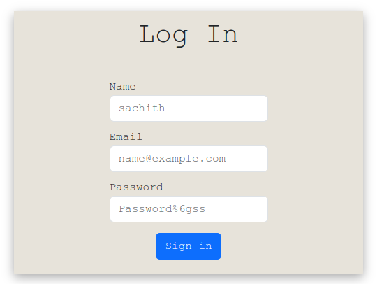

# Login Application

<p align="center">
  
</p>

This is a login application built using **Spring Boot** for the backend and **React.js** for the frontend. The application is containerized using Docker, and a Docker Compose setup is provided for seamless deployment.

---

## Features

- User authentication (login functionality).
- Backend API built with Spring Boot and exposed as REST endpoints.
- Frontend built with React.js for a responsive user interface.
- MySQL database for persistent storage.
- Dockerized setup for running the application in isolated containers.

---

## Prerequisites

Before running the application, ensure you have the following installed:

- [Docker](https://www.docker.com/)
- [Docker Compose](https://docs.docker.com/compose/)

---

## Setup Instructions

### 1. Clone the Repository

```bash
git clone (https://github.com/SachithRangana1/Login-View-Fullstack.git)t
cd login-backend
cd loin-ui 
```

### 2 Open the backend and frontend codes VSCode or IntelliJ idea
```bash
idea . 
```
or 
```bash
code . 
```

### 3. Run backend & up docker compose using terminal
```bash
docker-compose up
```

### 4. Run frontend
```bash
npm run dev
```


